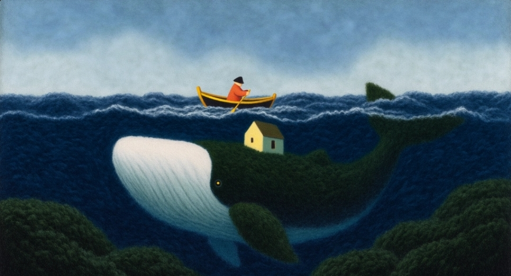

# 01 — Whale Island

**Universo:** poético y misterioso. Textura de lana/fieltro granulado, formas
simplificadas, océano azul marino profundo, cielo apagado. Un pescador rema
en una barca amarilla sobre una ballena gigante que lleva una casa y
vegetación en el lomo.

**Modo:** poetic · **Modelo:** Seedance 2.5 (10 s, 1080p, 16:9)

## Prompt

> Use the reference image as the only visual foundation. Create a highly dynamic animated sequence with multiple shots, frequent camera angle changes, dramatic push-ins and pull-backs, lateral tracking shots, low angles near the water, fast reframing, foreground wipes, parallax, and energetic cinematic cuts, while fully preserving the original painterly style, soft grainy texture, simplified shapes, deep navy-blue ocean, muted sky, composition, and poetic atmosphere. Do not make the image photorealistic or alter its handmade illustration technique. Animate the ocean with large rolling waves moving across different layers of depth. The small rowing boat rises and falls with the sea while the fisherman rows with visible effort. The whale beneath the surface moves slowly but powerfully, making the surrounding water swell. The house and vegetation on its back react subtly to wind and motion. Start with the original wide shot, rapidly push toward the boat, cut to a close side angle of the fisherman, whip-pan toward the waves, switch to a low water-level perspective, dive underwater to reveal the whale passing close to camera, then rise quickly back above the surface and pull far back to reveal the full scale of the scene. Add dramatic camera passes beside the boat, quick angle changes between the fisherman, whale, house, and horizon, and strong depth through foreground waves crossing the frame. Keep the scene poetic and mysterious, but visually spectacular and constantly evolving. Preserve the original brush texture and handmade feeling in every frame.

## Cómo se construye el prompt

| Elemento | En este prompt |
|---|---|
| Referencia visual | "Use the reference image as the only visual foundation" |
| Invariantes de estilo | painterly style, soft grainy texture, simplified shapes, deep navy-blue ocean, muted sky + negativa de fotorrealismo |
| Acciones | olas en capas, barca que sube y baja, pescador remando con esfuerzo, ballena lenta y potente, casa y vegetación con el viento |
| Secuencia de planos | plano general → push a la barca → lateral del pescador → whip-pan a las olas → nivel del agua → bajo el agua con la ballena → subida y pull-back de escala |
| Cámara | push-ins/pull-backs, tracking lateral, ángulos bajos, foreground wipes, parallax, whip pan |
| Ritmo y cierre | universo poético → juega con escala y profundidad; cierre "in every frame" |

> Nota: el prompt encadena ~8 momentos en 10 s. Según el procedimiento de la skill, si el clip pierde continuidad o fidelidad, reducir a 3-5 momentos o separar los planos en varias generaciones.
